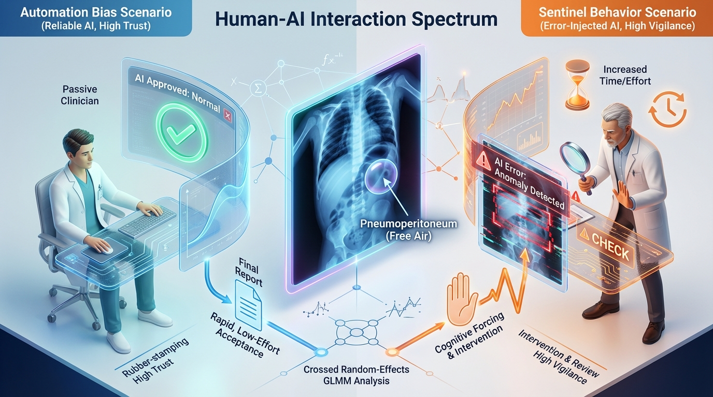

# Expertise-Dependent Verification Behaviors in Response to AI Reliability in Neonatal Pneumoperitoneum

**Lee et al.** · *Manuscript in Preparation*

> **One-line takeaway:** *AI reliability does not translate linearly into clinical benefit.* In a multi-reader, multi-center study, we demonstrate that **AI reliability acts as a modulator of verification behavior**. While "Reliable" AI induced automation bias in trainees, "Unreliable" AI paradoxically triggered **sentinel (vigilant) behavior** in experts.

---

## 🖼️ Visual Abstract: The Sentinel Effect vs. Automation Bias

**Visualizing the study's core behavioral discovery:**

This illustration represents the divergent verification behaviors observed in our multi-center study:

*   **Left (Automation Bias):** When interacting with **Reliable AI** (Blue stream), less experienced readers (Residents) tended to "offload" cognition. The smooth, accurate advice paradoxically reduced vigilance, leading to the acceptance of errors when they did occur.
*   **Right (The Sentinel Effect):** When interacting with **Error-Injected AI** (Red/Glitchy stream), experts (Neonatologists) engaged a "cognitive forcing function." The presence of systematic AI errors triggered a high-vigilance mode, where experts actively used tools to refute the AI, acting as a safety shield for the patient.

*Generated via NanoBanana based on the research paper's findings.*

## 👾 Model Architecture

To ensure that differences in reader behavior were driven solely by **reliability** (and not model capacity), both the "Reliable" and "Error-Injected" assistants utilized the exact same underlying architecture:

*   **Backbone:** **RAD-DINO** (ViT-B/14), a vision foundation model pre-trained on large-scale radiology datasets.
*   **Adaptation (LoRA):** Parameter-efficient fine-tuning using **Low-Rank Adaptation** ($r=12, \alpha=24$) injected into Query/Value projections and the MLP layer. Only **1.36%** of parameters were trainable, preventing catastrophic forgetting.
*   **Sampling Strategy (RFBS):** A custom **Representation-Focused Batch Sampler** was used to enforce diversity and ensure exposure to uncommon pneumoperitoneum distributions during training.

> **Note:** The "Error-Injected" model was created using this same robust architecture but trained on **systematically poisoned labels** (e.g., labeling drains or pneumatosis as free air) to simulate "plausible" AI errors.

---

## 🎯 Why This Matters
Neonatal pneumoperitoneum is a time-critical surgical emergency. However, integrating AI into this high-stakes workflow is not just about model accuracy (AUC). Clinicians interact with **advice, confidence cues, and time pressure**.

This study investigates the **Human-AI Interaction (HAI) layer**:
1.  **Verification Phenotypes:** When AI is *highly capable*, does it help—or does it reduce human effort?
2.  **The "Sentinel" Effect:** When AI is *systematically wrong*, do clinicians disengage, blindly follow, or become hyper-vigilant?
3.  **Expertise Gradient:** Do neonatologists, radiologists, and residents react differently to the same AI signals?

---

## 🔬 Study Overview

### 1. Cohorts
*   **Internal Development:** 688 radiographs (310 positive) from 216 neonates.
*   **External Validation (Reader Study):** 125 radiographs (40 positive) from **11 tertiary hospitals** via AI-Hub.

### 2. The Reader Study
*   **Participants (N=14):** 
    *   Pediatric Radiologists ($n=6$)
    *   Neonatologists ($n=3$)
    *   Radiology Residents ($n=5$)
*   **Design:** Two-session, counterbalanced **MRMC Crossover** with a 6-week washout.

  

*   **Case Allocation (Stratified):**
    *   **Unaided** ($n=41$)
    *   **Reliable AI** ($n=40$)
    *   **Error-Injected AI** ($n=44$)

> **Note:** Reliability was fixed at the *case level*. Readers were blind to the specific reliability condition of any given case, ensuring natural behavioral responses.

---

## 🤖 AI Tools Evaluated

We compared two distinct "advice streams" generated by the same Vision Foundation Model (RAD-DINO + LoRA) architecture:

| Model Phenotype | AUC (Study Subset) | Characteristics | Purpose |
| :--- | :--- | :--- | :--- |
| **Reliable AI** | **0.861** | High-performance, standard training. | To test **Automation Complacency**. |
| **Error-Injected AI** | **0.43** | Intentionally engineered via systematic label bias (e.g., drains, pneumatosis). | To test **Sentinel Behavior** (response to failure). |

> ⚠️ **Clinical Note:** The *Error-Injected AI* is an experimental probe only and is **not** intended for clinical deployment.

---

## 📊 Statistical Methodology
Our primary analysis utilizes a **Crossed Random-Effects Generalized Linear Mixed Model (GLMM)**. 

Unlike simple aggregate comparisons, this method:
1.  **Controls for Case Difficulty:** Random intercept for `Case_ID` ($1 | filename$) accounts for intrinsic image difficulty.
2.  **Controls for Reader Variability:** Random intercept for `Reader_ID` ($1 | reader$) accounts for individual competence.
3.  **Isolates Interaction:** Accurately estimates the **Condition × Expertise** interaction term.

---

## 🗝️ Key Findings

### 1. The Interaction Effect: Divergent Trajectories
The primary GLMM revealed a significant interaction ($p=0.020$) between Neonatologists and the Error-Injected AI condition.

| Contrast (vs Pediatric Radiologist) | Odds Ratio (OR) | 95% CI | P-value |
| :--- | :--- | :--- | :--- |
| **Interaction: Error-Injected × Neonatologist** | **4.16** | **1.26–13.77** | **0.020** |

*Interpretation:* While the reference group (Radiologists) showed stable or declining odds under error-prone AI, Neonatologists exhibited a statistically distinct **positive trajectory**, indicating a shift toward active verification ("Sentinel Behavior").

### 2. Mechanisms: Trust vs. Vigilance
We decomposed behavior in cases where the AI was incorrect:

*   **Automation Bias (Residents):** Rapidly accepted incorrect advice from "Reliable" AI in **52.0%** of discordant cases.
*   **Sentinel Behavior (Neonatologists):** Successfully overrode "Error-Injected" AI in **91.6%** of discordant cases.

### 3. Verification Effort (Time Analysis)
Disagreement acted as a **Cognitive Forcing Function** for experts:
*   **Neonatologists:** 10.04s (Discordant) vs 5.42s (Concordant) → **+4.62s deliberation penalty**.
*   **Residents:** No significant time penalty ($p>0.05$), consistent with "cognitive short-circuiting" (rapid acceptance/rejection without deep verification).

### 4. Explainability (Saliency Maps)
*   **Residents:** Viewed CAMs frequently (53.8% of errors) but accuracy remained low (78.2%).
*   **Experts:** Viewed CAMs sparingly (17.2%) but achieved **100% accuracy** when they did, suggesting "utility-triggered" verification.

---

## 📜 Citation
If you use these findings or the "Error-Injection" validation framework, please cite:

> **Lee et al.** *Expertise-Dependent Verification Behaviors in Response to AI Reliability in Neonatal Pneumoperitoneum: A Multi-Reader Multi-Center Study.* (Under Review, 2026)

---

## ✉️ Correspondence
*   **Namkug Kim, PhD** (Medical Imaging and Intelligent Reality Lab, Asan Medical Center)
*   **Hee Mang Yoon, MD, PhD** (Massachusetts General Hospital / Asan Medical Center)